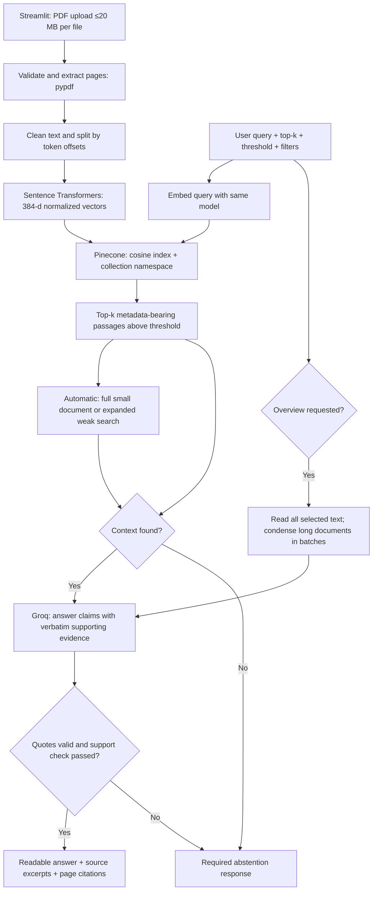

# PDF Evidence — Grounded RAG for PDF Documents

> Upload PDFs, ask naturally, and verify every answer with page-level evidence.


PDF Evidence is a professional Retrieval-Augmented Generation (RAG) dashboard for asking questions about PDF documents. It extracts and chunks PDF text, creates local embeddings, indexes vectors in Pinecone, retrieves relevant context, and generates source-backed answers using Groq. Every answer includes supporting excerpts and PDF page references.

<p align="center">
  
</p>

## Why this project

- **Grounded answers:** Generated claims must cite real PDF text and pass a second source-support check.
- **Professional dashboard:** Upload, index, summarize, search, inspect sources, and manage a session collection from one Streamlit interface.
- **Flexible questions:** Ask in English or Roman Urdu; request a summary, main topics, or a specific fact.
- **Traceable retrieval:** Each source shows the PDF name, physical page, excerpt, chunk, and semantic similarity when applicable.
- **Assignment-ready design:** Demonstrates Pinecone index creation, namespaces, metadata, upserts, cosine retrieval, filters, and cleanup.

## Product overview

| Capability | What it does |
|---|---|
| PDF knowledge base | Accepts one or more text-based PDFs up to 20 MB each and preserves PDF page provenance. |
| Smart overview | Reads all selected document text for summaries; longer selections are condensed in bounded batches. |
| Automatic search | Uses Pinecone semantic retrieval and expands weak searches when needed. |
| Strict similarity | Uses only Pinecone matches above the chosen cosine threshold. |
| Evidence panel | Makes the exact source text and page references visible for every returned claim. |

## Quick start

### Run locally

Requires Python 3.11+, a Pinecone account, a Groq API key, and internet access for first-time model download and API calls. Start in this repository's root directory.

```powershell
python -m venv .venv
.\.venv\Scripts\python -m pip install -r requirements-dev.txt
Copy-Item .env.example .env
# Edit .env to set PINECONE_API_KEY and GROQ_API_KEY.
.\.venv\Scripts\python -m streamlit run app.py
```

On macOS/Linux use `.venv/bin/python` and `cp .env.example .env`. For application-only installation, use `requirements.txt`. API/model service usage depends on your provider account; no keys are included. The embedding model runs on CPU.

1. Upload one or more text-based PDFs, each up to 20 MiB (20 × 1024 × 1024 bytes).
2. Set chunk size and overlap, then select **Index selected PDFs**.
3. Choose **Summarize documents**, **Show main topics**, or ask a question in English or Roman Urdu. Automatic mode reads small documents in full and expands weak searches. Choose Strict similarity to enforce the top-k/threshold settings without fallback.
4. Inspect numbered evidence citations and retrieved passages.
5. Use **Delete this session's indexed data** before leaving to remove your collection.

Indexing replaces the active collection only after all uploads succeed and Pinecone reports the expected vector count. Identical file contents are deduplicated; the first filename is retained. Changing chunk settings requires indexing again. Page numbers refer to PDF page positions, which may differ from printed page labels.

## Architecture and features

| Requirement | Implementation |
|---|---|
| PDF validation, extraction, cleanup | `rag/loader.py`: signature, size, damaged/encrypted/empty PDF checks |
| Intelligent chunking | `rag/chunker.py`: tokenizer-aware windows, sentence preference, overlap, page boundaries |
| Embeddings | `rag/embeddings.py`: normalized 384-dimensional MiniLM vectors |
| Pinecone index creation | `rag/vector_store.py`: serverless index, cosine, dimension validation, readiness polling |
| Namespaces and upserts | Fresh UUID namespace per collection; batched vectors with source metadata |
| Semantic retrieval | Cosine top-k, adjustable threshold, document/page/model filters |
| Grounded generation | `rag/generator.py`: structured answer claims, exact quote validation, second-pass source-support checking |
| Insufficient information | Exact response: `The answer is not available in the provided document.` |
| Source references | Filename, physical page, excerpt, chunk ID, similarity |
| Mandatory enhancements | Multi-document support, session history, adjustable chunk size, adjustable top-k, metadata filtering (five) |
| Errors and secrets | `.env`, safe UI errors, no API keys in source |

## Architecture



Standalone diagram: [docs/architecture.svg](docs/architecture.svg). Technical report: [docs/technical_report.md](docs/technical_report.md). Demo walkthrough: [docs/demo_script.md](docs/demo_script.md).

## Configuration

| Variable | Default | Purpose |
|---|---|---|
| `PINECONE_API_KEY` | Required | Pinecone access |
| `GROQ_API_KEY` | Required | Groq generation |
| `PINECONE_INDEX` | `pdf-rag-minilm-v1` | Dedicated index for this embedding model |
| `PINECONE_CLOUD` | `aws` | Serverless cloud |
| `PINECONE_REGION` | `us-east-1` | Region available to your account |
| `GROQ_MODEL` | `qwen/qwen3.8-27b` | Available Groq model with JSON object responses; configured in non-thinking mode |

The embedding model is fixed to `sentence-transformers/all-MiniLM-L6-v2`. Index dimension is 384 and metric is cosine. Existing incompatible indexes are rejected. Use a dedicated index name if other projects use a different 384-dimensional model. Metadata contains `page`, `document_name`, `document_id`, `chunk_id`, `text`, and `embedding_model`.

The Pinecone SDK is constrained to the 7.x vector API used by this implementation. The code explicitly demonstrates `create_index`, `upsert`, `query`, metadata filters, namespaces, and `delete`. It does not require LangChain.

## Grounding policy and limits

The LLM returns answer claims with supporting quotes. Every source ID must exist and every quote must be an exact contiguous substring of its source. A second LLM call checks each claim against the cited excerpts and surrounding text. Only answers whose entire set of claims passes are displayed. Invalid quotes, malformed output, and unsupported claims are rejected. With no context, the answer generator is not called. API failures are shown as errors, not falsely reported as missing document evidence.

Quote provenance is checked deterministically, but paraphrase support is checked probabilistically by an LLM and **does not guarantee** correctness, relevance, or completeness. Documents can contain incorrect claims or malicious instructions, and the verifier can share the answer model's mistakes. Inspect the supporting text for important decisions. Cosine similarity is a retrieval score, not calibrated confidence.

Summary requests bypass semantic similarity and read all selected extracted text. Larger documents are condensed in batches with exact source quotes, then summarized; this can omit minor details. Overviews exceeding 24 input batches ask the user to select fewer documents or a page instead of silently sampling. Automatic specific-question search reads small collections in full; on weak results for larger collections it rephrases the search in English, relaxes the threshold, and adds literal keyword candidates. Strict mode preserves the original threshold contract. All routes honor document/page selection. Direct-text sources display no invented similarity score.

Try: `Summarize this document`, `What are the main topics?`, `Explain the main concepts`, or `Is document ka khulasa batao`. For detailed questions, name the topic or person in the PDF. Follow-up pronouns do not inherit prior context: each question is independent. Roman Urdu questions are supported by the LLM, but the English-oriented embedding model limits large multilingual-corpus retrieval.

OCR, images and reliable reconstruction of complex tables remain outside scope. Blank/image-only pages are skipped with a warning; fully scan-only PDFs are rejected. Normalization and reading order may affect source text. History is limited to 20 entries and is never used as evidence. Local `.env` settings override environment values on reload so model changes can take effect without restarting the app.

The app is an educational local interface without authentication. Text/metadata persist in Pinecone; questions and selected context go to Groq. Browser refresh can lose the session's namespace handle. Delete namespaces using the UI before leaving or the Pinecone console afterward. The app never deletes a whole index. Namespace isolation prevents accidental mixing, but it is not an authentication system. No durable query log is created.

## Verification and reproducible demo

```powershell
.\.venv\Scripts\python -m pytest -q
.\.venv\Scripts\python -m ruff check .
.\.venv\Scripts\python scripts/make_demo_pdf.py
.\.venv\Scripts\python scripts/build_report.py
# Check the real local model without Pinecone/Groq credentials:
.\.venv\Scripts\python scripts/check_embeddings.py
# After setting API keys (creates and then removes a temporary Pinecone namespace):
.\.venv\Scripts\python scripts/evaluate.py
.\.venv\Scripts\python scripts/check_live_answers.py
```

Offline tests cover PDF errors, chunk coverage, namespace/filter behavior, failure handling, evidence validation, and the Streamlit landing screen. They mock external services and do not establish live retrieval accuracy. `evaluate.py` uses real embeddings, Pinecone, and Groq against the included controlled question set. It writes measured retrieval recall, answer checks, abstention behavior, and timing to `artifacts/evaluation.json`. See [docs/evaluation.md](docs/evaluation.md) for interpretation. Do not claim live performance before running this benchmark.

The offline suite also covers overview routing, full-document fallback, summary batches, scoped document/page selection, and generated-claim validation. The live answer check exercises the original failing summary question, a fact question, Roman Urdu, and abstention on missing information. The ten-question retrieval benchmark defaults to strict mode so whole-document fallback does not inflate retrieval recall. See [docs/validation.md](docs/validation.md) for recorded results and verification limits.

## Submission deliverables

- Source code: this directory, ready to push to a GitHub repository you own; no repository URL has been created.
- Architecture diagram: `docs/architecture.svg` and the Mermaid source above.
- Four-page technical report: `docs/technical_report.pdf`, reproducible from Markdown.
- Demo: sample PDF and a timed 6-minute script; record the actual working app to produce the required 5–7 minute video.

## Primary references

- [Pinecone dense indexes](https://docs.pinecone.io/guides/index-data/create-an-index), [upserting vectors](https://docs.pinecone.io/guides/index-data/upsert-data), [metadata filters](https://docs.pinecone.io/guides/search/filter-by-metadata)
- [MiniLM model card](https://huggingface.co/sentence-transformers/all-MiniLM-L6-v2)
- [Groq JSON/structured output documentation](https://console.groq.com/docs/structured-outputs)
- [Streamlit upload API](https://docs.streamlit.io/develop/api-reference/widgets/st.file_uploader)
